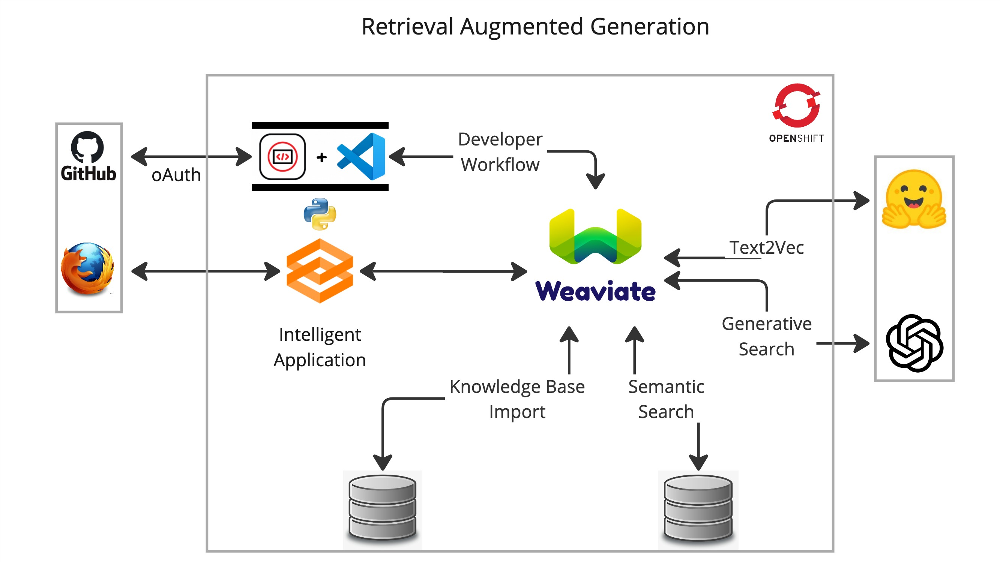

# JumpStart your [Vector Database](https://weaviate.io/) to enterprise scale with [Openshift](httos://okd.io)

## Agenda

### What we will build.


### What's needed:
- Access to a free [Openshift Developer Sandbox](https://developers.redhat.com/developer-sandbox).
- A Weaviate vector database service.
- A [HuggingFace API key](https://huggingface.co/settings/tokens).
- An [OpenAI API key](https://platform.openai.com/account/api-keys).

### Why run Weaviate On Openshift
- Support for [Distributed Architectures](https://weaviate.io/developers/weaviate/concepts/replication-architecture).
- A Great Developer Experience (Easily move code -> containers)
- Access your cluster via the Weaviate Cloud Console with external routes.
- Security (Doesn't run your containers as root)

### Get Started
- [Open this repo in the Developer Sandbox](https://workspaces.openshift.com/f?url=https://github.com/bkoz/weaviate)

### [Install Weaviate](install-weaviate.md) on Openshift

### Developer Tools: Eclipse-Che/DevSpaces
- A full IDE experience with a code debugger.
- Leverage many VSCode extensions.
- In cluster terminal with CLI access to the Openshift API.
- Deploy and test your app with port forwarding.
- GitHub integration improves workflow efficiency.
- Environment variables are read in as secrets.
- The price is right.

#### Setup: Developer Workflow with Eclipse-Che/DevSpaces
1) Set Enviroment variables
  - **View -> Command Palette** -> and enter: `dev spaces: open openshift console`.
  - **Secrets -> create** and **save** a new secret (from yaml) using this [example](resources/che-env.yaml).
  - **Edit ->** change the values in the secret to match your environment. Your instructor will provide the values.
2) Install the reccomended VSCode **python extension**.
3) **View -> Command Pallette** and enter: `run task` -> devfile -> Create a python virtual environment
4) **Terminal -> New Terminal**
```bash
curl ${WEAVIATE_URL} | jq
```
5) Run a few python test clients from the `src` directory.

### Move the app into production.
Create a project using your initials. The Developer Sandbox won't let you create new projects so you can 
skip this step and just use the namespace that you are given.
```bash
PROJ=bk-apps
oc new-project $PROJ
```
Create the application.
```bash
oc new-app python~https://github.com/bkoz/weaviate --context-dir=/src --name=rag
```
Create a secret for the application environment variables from the example.
```bash
oc apply -f resources/app-env.yaml
```
Use the web console UI or CLI to edit the values in the secret to reflect your environment.

Add the secret to the rag deployment.
```bash
oc set env --from=secret/app-env deployment/rag
```
Expose the app with a route.
```bash
oc create route edge --service rag --insecure-policy='Redirect'
```
### Additional ways to get access to Openshift.
- Create a mini-cluster by [installing Code Ready Containers](https://www.okd.io/crc/)
- Install an [OKD cluster](https://www.okd.io/installation/) and Eclipse-Che.
- Install an [Openshift](https://www.redhat.com/en/technologies/cloud-computing/openshift) cluster and DevSpaces.
- As a managed service from any of the major cloud providers.

#### Versions
v0.1.0
